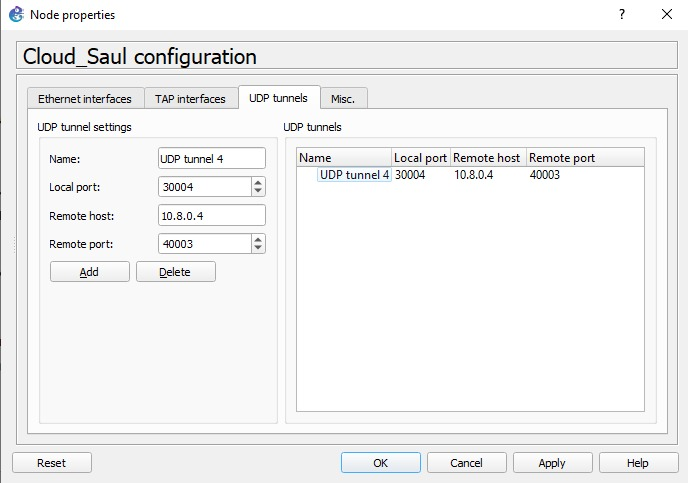
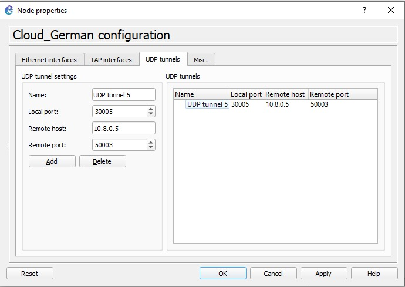
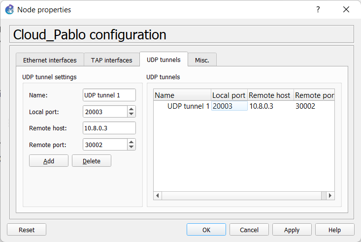
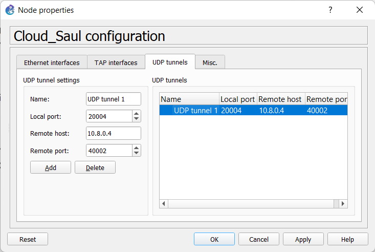
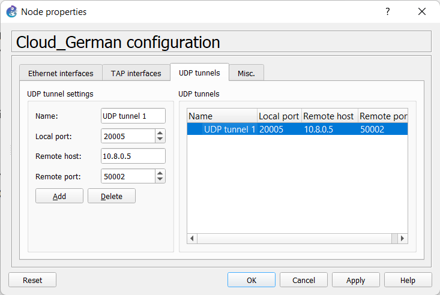
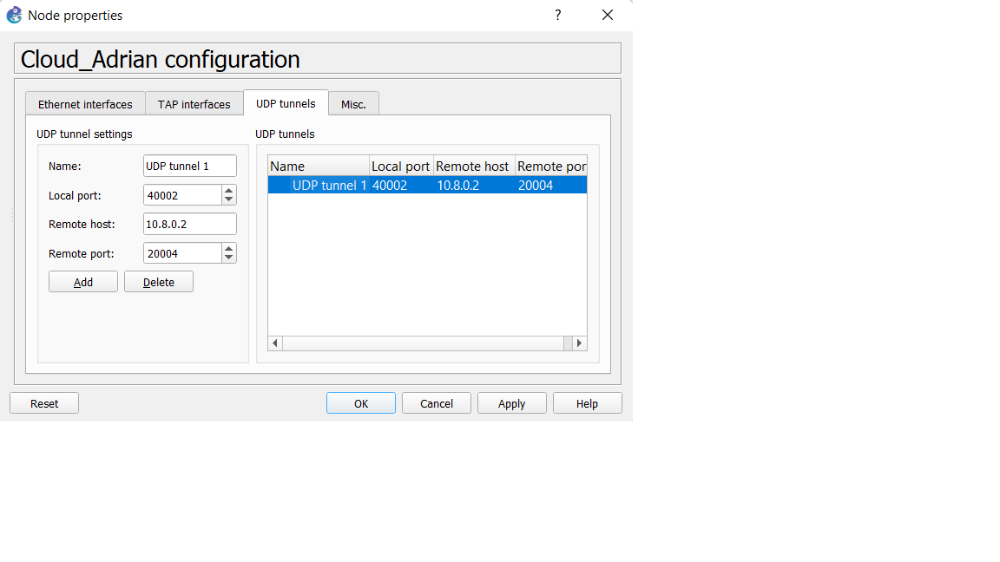
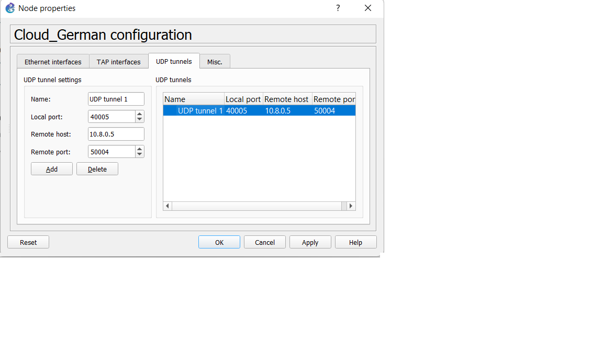
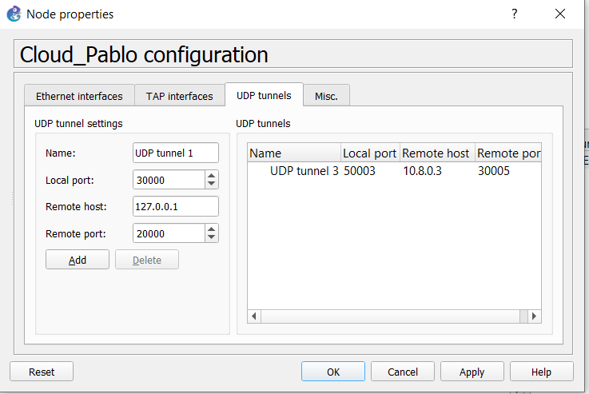
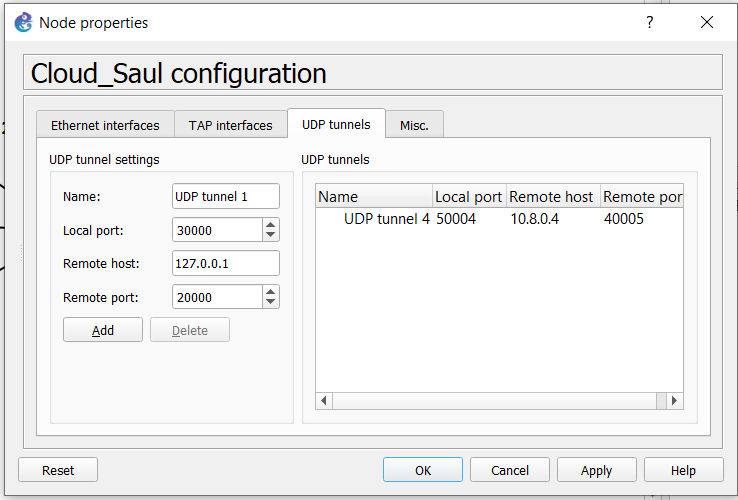

# Practica 1
---------------
### Integrantes
|Carne | Nombre | Perfil
|-----|-----|-----|
|201901510| Pablo Daniel Rivas Marroquin| https://github.com/PabloRivas201901510
|201902850 |Adrian Samuel Molina Cabrera| https://github.com/AdrianMolina2000
|201807160 | Saul Absalon Barillas Argueta| https://github.com/SaulB10
|201902934 |German Jose Paz Cordon| https://github.com/GermanJosePazCordon

## Configuración de las VPCs

## Configuración de las nubes

### Pablo Daniel Rivas Marroquin, 201901510
##### Conexion con Adrian

##### Conexion con Saul

##### Conexion con German

### Adrian Samuel Molina Cabrera, 201902850
##### Conexion con Pablo

##### Conexion con Saul

##### Conexion con German

### Saul Absalon Barillas Argueta, 201807160
##### Conexion con Pablo

##### Conexion con Adrian

##### Conexion con German

### German Jose Paz Cordon, 201902934
##### Conexion con Pablo

##### Conexion con Saul

##### Conexion con German

## Pings entre los hosts

