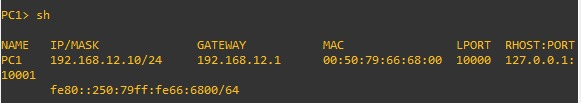
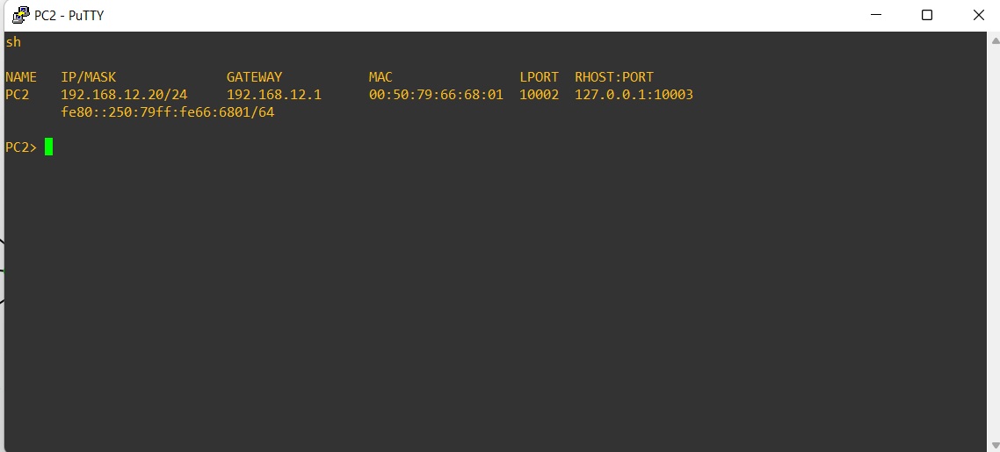
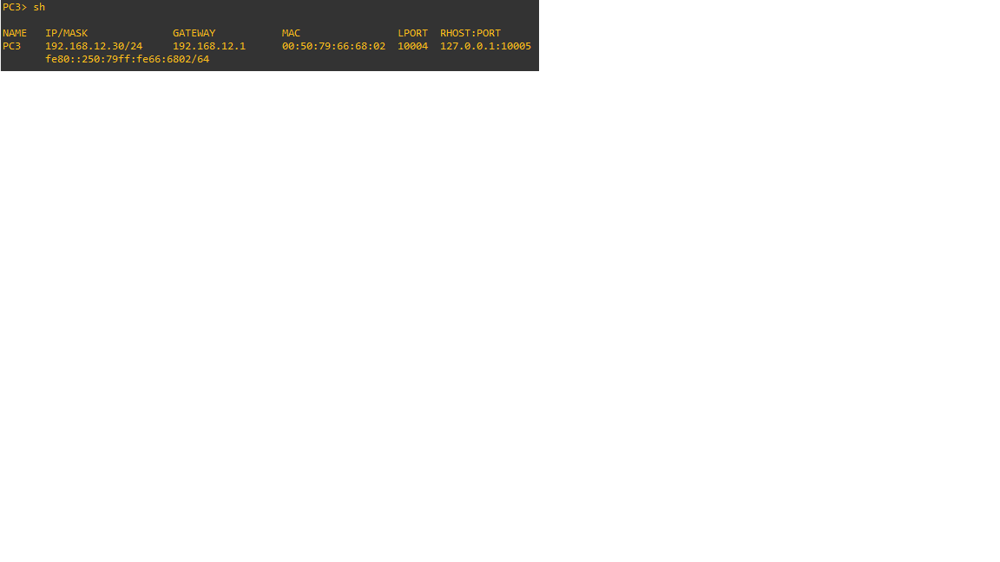
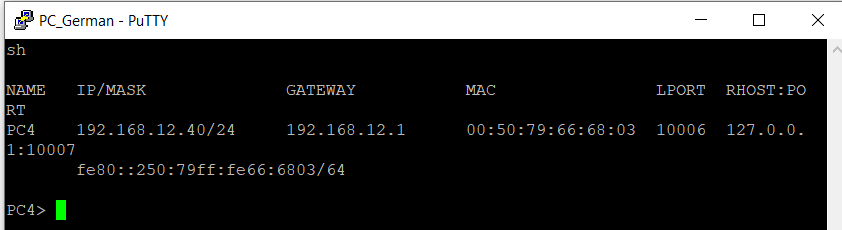
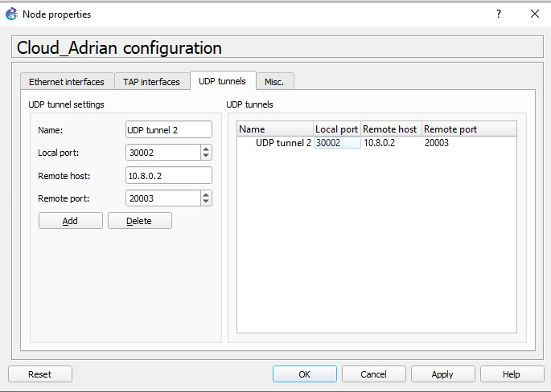
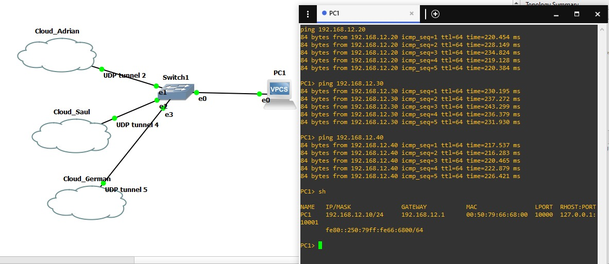
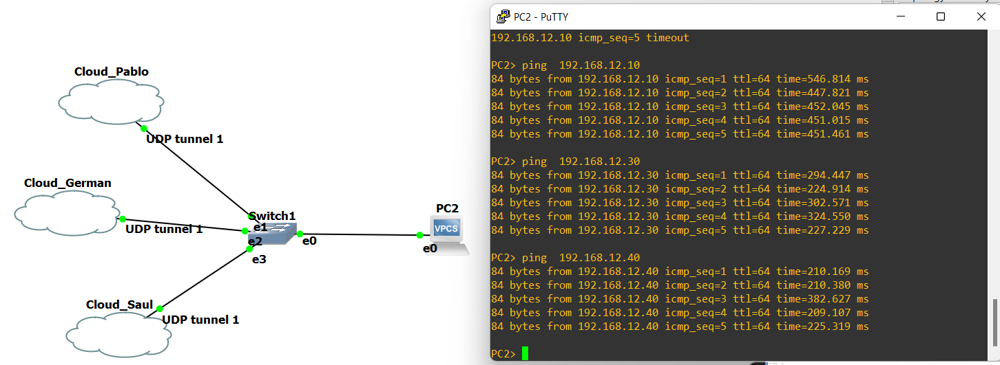
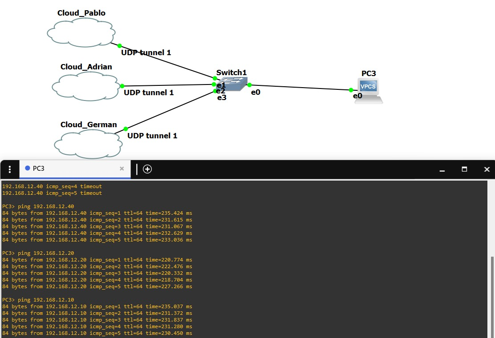
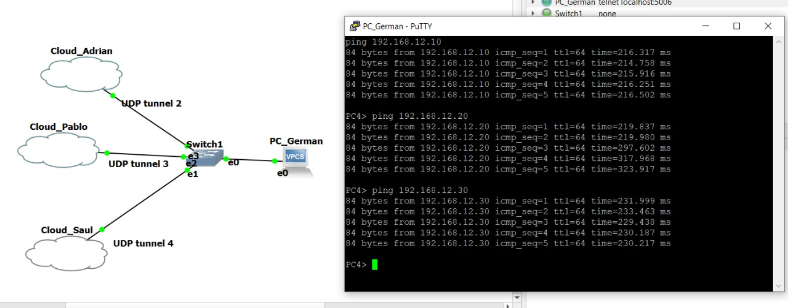

# Practica 1
---------------
### Integrantes
|Carne | Nombre | Perfil |
|-----|-----|-----|
|201901510| Pablo Daniel Rivas Marroquin| https://github.com/PabloRivas201901510 |
|201903850 |Adrian Samuel Molina Cabrera| https://github.com/AdrianMolina2000 |
|201807160 | Saul Absalon Barillas Argueta| https://github.com/SaulB10 |
|201902934 |German Jose Paz Cordon| https://github.com/GermanJosePazCordon |


## Configuración de las VPCs
| Posición | Nombre | Numero IP |
|-----|-----|-----|
|Coordinador| Pablo Daniel Rivas Marroquin| 192.168.12.10 |
|Estudiante 1 |Adrian Samuel Molina Cabrera| 192.168.12.20 |
|Estudiante 2 | Saul Absalon Barillas Argueta| 192.168.12.30 |
|Estudiante 3 |German Jose Paz Cordon| 192.168.12.40 |
```
192.168.12.1  = GATEWAY
255.255.255.0  = MASCARA

ip “NUMERO_IP” “NUMERO_MASCARA_SUBRED” “GATEWAY”
```
### Pablo Daniel Rivas Marroquin, 201901510
```
NUMERO_IP: 192.168.12.10
```

### Adrian Samuel Molina Cabrera, 201903850
```
NUMERO_IP: 192.168.12.20
```

### Saul Absalon Barillas Argueta, 201807160
```
NUMERO_IP: 192.168.12.30
```

### German Jose Paz Cordon, 201902934
```
NUMERO_IP: 192.168.12.40
```


## Configuración de las nubes

### Pablo Daniel Rivas Marroquin, 201901510
##### Conexion con Adrian

##### Conexion con Saul

##### Conexion con German


### Adrian Samuel Molina Cabrera, 201903850
##### Conexion con Pablo

##### Conexion con Saul

##### Conexion con German


### Saul Absalon Barillas Argueta, 201807160
##### Conexion con Pablo

##### Conexion con Adrian

##### Conexion con German


### German Jose Paz Cordon, 201902934
##### Conexion con Pablo

##### Conexion con Saul

##### Conexion con German


## Pings entre los hosts
### Pablo Daniel Rivas Marroquin, 201901510

### Adrian Samuel Molina Cabrera, 201903850

### Saul Absalon Barillas Argueta, 201807160

### German Jose Paz Cordon, 201902934


