# Practica 1
---------------
## Integrantes
|Carne | Nombre | Perfil |
|-----|-----|-----|
|201901510| Pablo Daniel Rivas Marroquin| https://github.com/PabloRivas201901510 |
|201903850 |Adrian Samuel Molina Cabrera| https://github.com/AdrianMolina2000 |
|201807160 | Saul Absalon Barillas Argueta| https://github.com/SaulB10 |
|201902934 |German Jose Paz Cordon| https://github.com/GermanJosePazCordon |


## TOPOLOGIA 2
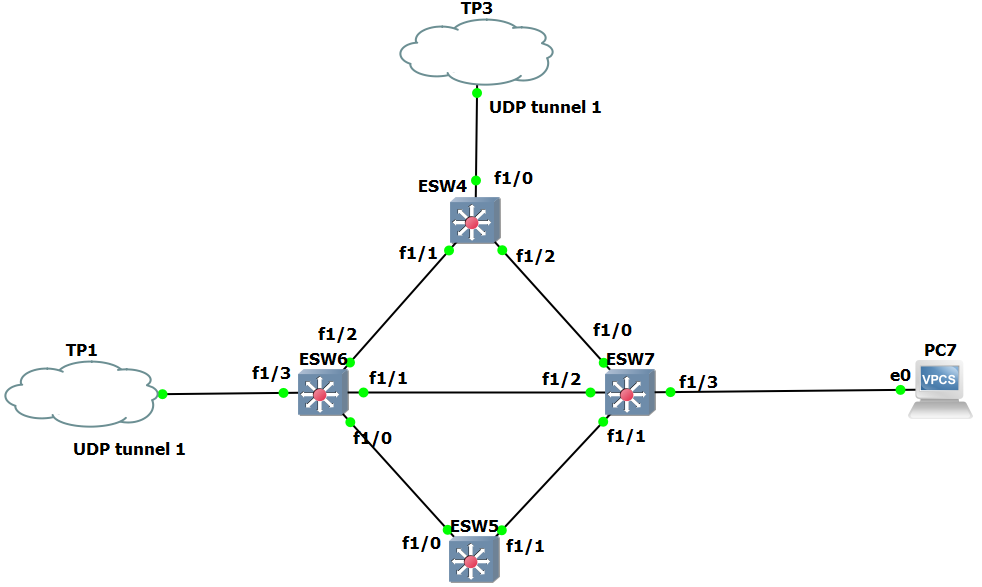

### ESW4

#### VLANS 
```
conf t
vlan 10
name RRHH
vlan 20
name Informatica
vlan 30
name Contabilidad
vlan 40
name Ventas
```
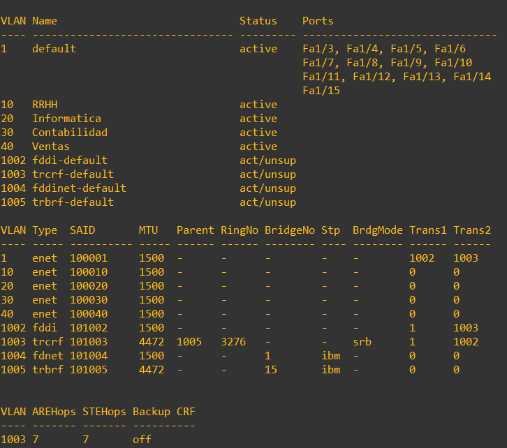

#### VTP
```
conf t
vtp domain GRUPO2
vtp password grupo2
vtp mode server
vtp version 2
```
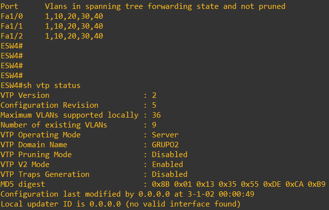

#### PUERTOS
```
int f1/0
switchport mode trunk
switchport trunk allowed vlan 1,10,20,30,40,1002-1005

int f1/1
switchport mode trunk
switchport trunk allowed vlan 1,10,20,30,40,1002-1005

int f1/2
switchport mode trunk
switchport trunk allowed vlan 1,10,20,30,40,1002-1005
```
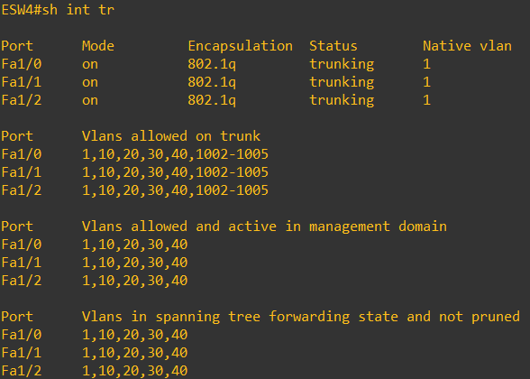

#### STP
```
spanning-tree vlan 10 root primary
spanning-tree vlan 20 root primary
spanning-tree vlan 30 root primary
spanning-tree vlan 40 root primary
```
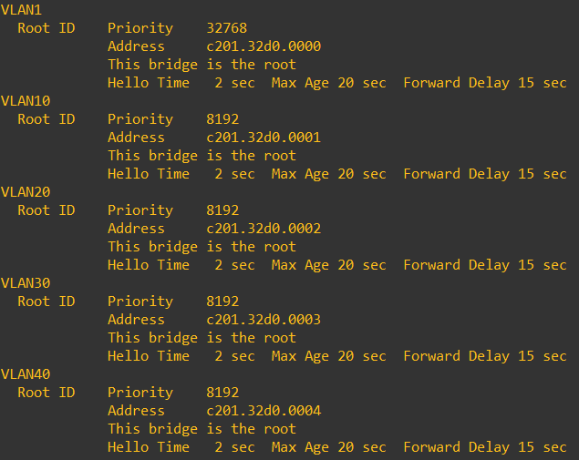

### ESW5
#### VTP
```
conf t
vtp domain GRUPO2
vtp password grupo2
vtp mode client
vtp version 2
```
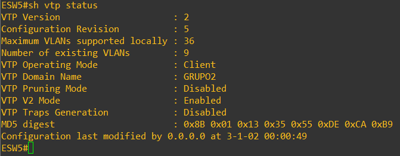

#### PUERTOS
```
int f1/0
switchport mode trunk
switchport trunk allowed vlan 1,10,20,30,40,1002-1005

int f1/1
switchport mode trunk
switchport trunk allowed vlan 1,10,20,30,40,1002-1005
```
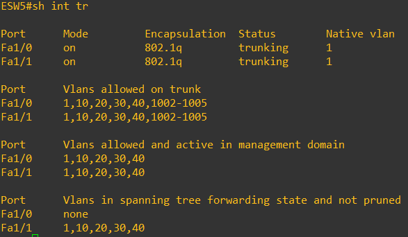

#### VLANS
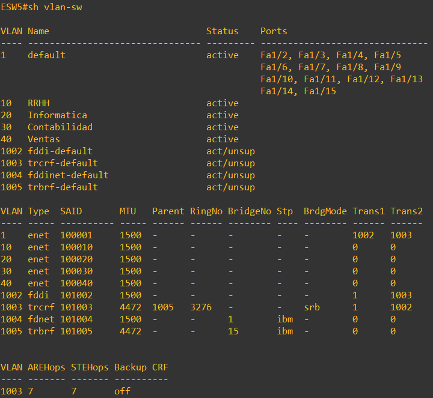

### ESW6
#### VTP
```
conf t
vtp domain GRUPO2
vtp password grupo2
vtp mode client
vtp version 2
```
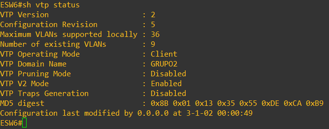

#### PUERTOS
```
int f1/0
switchport mode trunk
switchport trunk allowed vlan 1,10,20,30,40,1002-1005

int f1/1
switchport mode trunk
switchport trunk allowed vlan 1,10,20,30,40,1002-1005

int f1/2
switchport mode trunk
switchport trunk allowed vlan 1,10,20,30,40,1002-1005

int f1/3
switchport mode trunk
switchport trunk allowed vlan 1,10,20,30,40,1002-1005
```
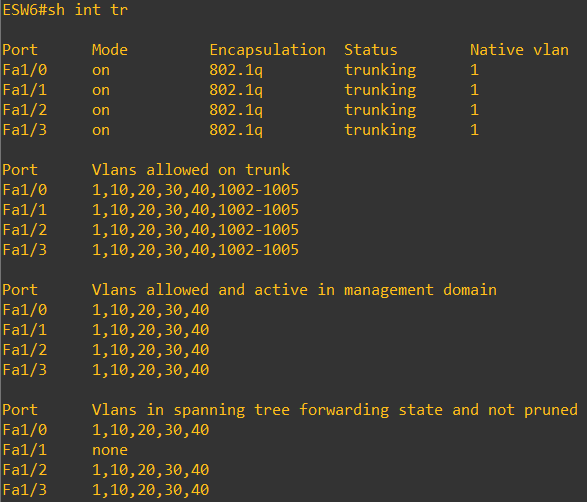

#### VLANS
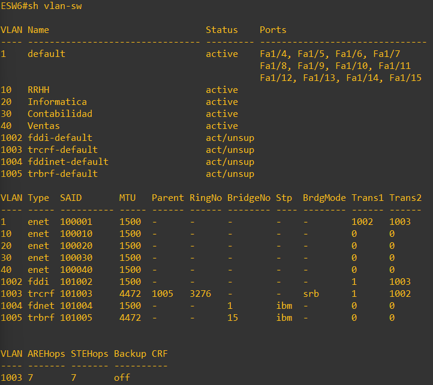

### ESW7
#### VTP
```
conf t
vtp domain GRUPO2
vtp password grupo2
vtp mode client
vtp version 2
```
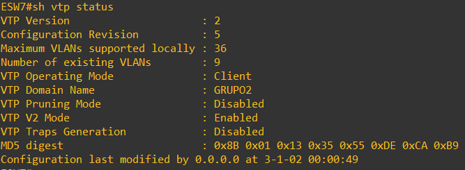

#### PUERTOS
```
int f1/0
switchport mode trunk
switchport trunk allowed vlan 1,10,20,30,40,1002-1005

int f1/1
switchport mode trunk
switchport trunk allowed vlan 1,10,20,30,40,1002-1005

int f1/2
switchport mode trunk
switchport trunk allowed vlan 1,10,20,30,40,1002-1005

int f1/3
switchport mode acces
switchport acces vlan 20
```
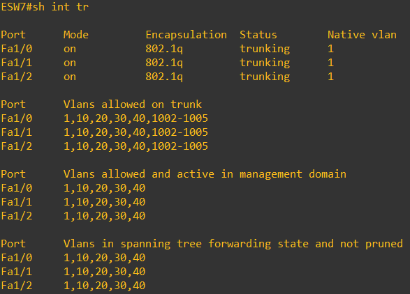

#### VLANS
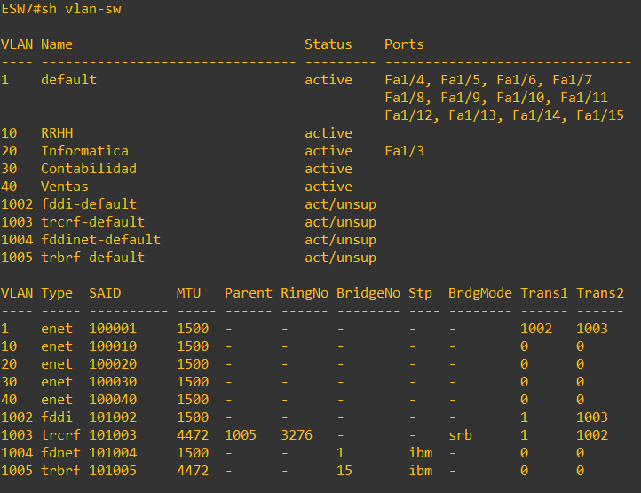

## TOPOLOGIA 3
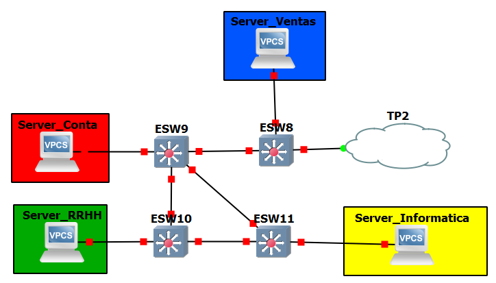

### ESW8

#### VLANS 
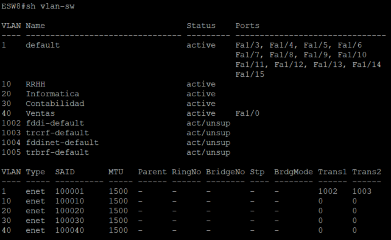

#### VTP
```
conf t
vtp domain GRUPO2
vtp password grupo2
vtp mode server
vtp version 2
```
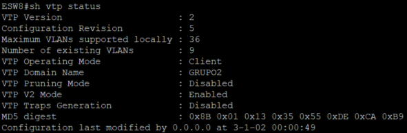

#### PUERTOS
```
conf t
int f1/0
switchport mode access
switchport access vlan 40
exit

int f1/1
switchport mode trunk
switchport trunk allowed vlan 1,10,20,30,40,1002-1005
exit

int f1/2
switchport mode trunk
switchport trunk allowed vlan 1,10,20,30,40,1002-1005
```
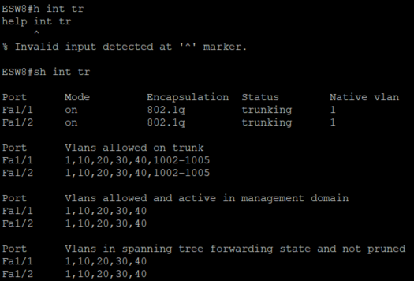

### ESW9

#### VLANS 
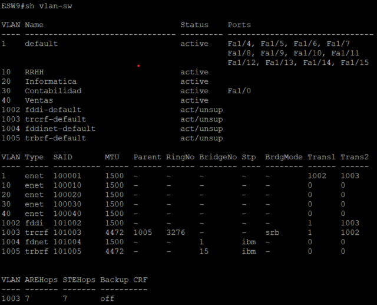

#### VTP
```
conf t
vtp domain GRUPO2
vtp password grupo2
vtp mode server
vtp version 2
```
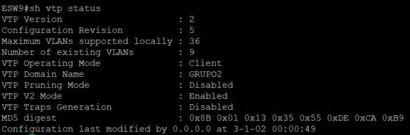

#### PUERTOS
```
conf t
int f1/0
switchport mode access
switchport access vlan 30
exit

int f1/1
switchport mode trunk
switchport trunk allowed vlan 1,10,20,30,40,1002-1005
exit

int f1/2
switchport mode trunk
switchport trunk allowed vlan 1,10,20,30,40,1002-1005
exit

int f1/3
switchport mode trunk
switchport trunk allowed vlan 1,10,20,30,40,1002-1005
```
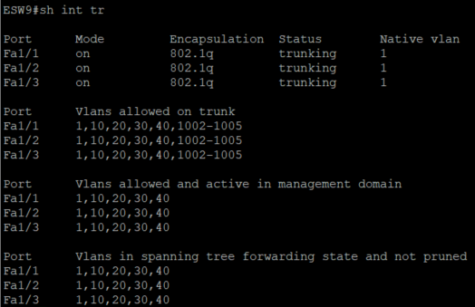

### ESW10

#### VLANS 
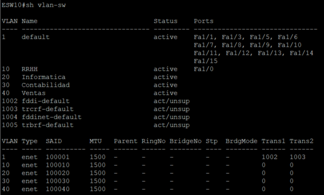

#### VTP
```
conf t
vtp domain GRUPO2
vtp password grupo2
vtp mode server
vtp version 2
```
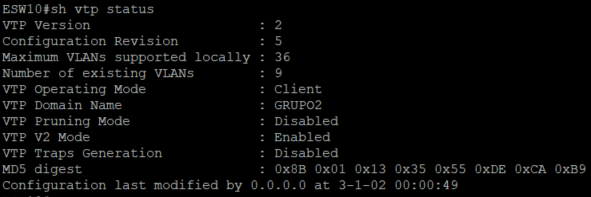

#### PUERTOS
```
conf t
int f1/0
switchport mode access
switchport access vlan 10
exit

int f1/2
switchport mode trunk
switchport trunk allowed vlan 1,10,20,30,40,1002-1005
exit

int f1/4
switchport mode trunk
switchport trunk allowed vlan 1,10,20,30,40,1002-1005
```
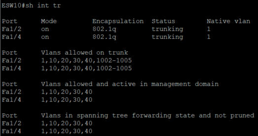

### ESW11

#### VLANS 
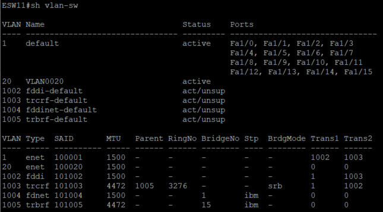

#### VTP
```
conf t
vtp domain GRUPO2
vtp password grupo2
vtp mode server
vtp version 2
```
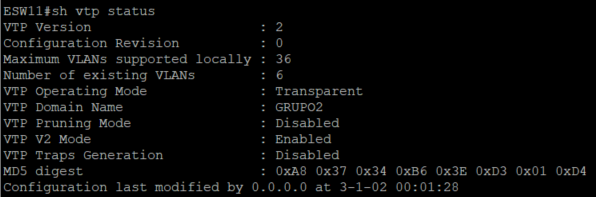

#### PUERTOS
```
conf t
int f1/0
switchport mode access
switchport access vlan 20
exit

int f1/3
switchport mode trunk
switchport trunk allowed vlan 1,10,20,30,40,1002-1005
exit

int f1/4
switchport mode trunk
switchport trunk allowed vlan 1,10,20,30,40,1002-1005
```
