# Proyecto 2
---------------
## Integrantes
|Carne | Nombre | Perfil |
|-----|-----|-----|
|201901510| Pablo Daniel Rivas Marroquin| https://github.com/PabloRivas201901510 |
|201903850 |Adrian Samuel Molina Cabrera| https://github.com/AdrianMolina2000 |
|201807160 | Saul Absalon Barillas Argueta| https://github.com/SaulB10 |
|201902934 |German Jose Paz Cordon| https://github.com/GermanJosePazCordon |

## Manual Tecnico
Este proyecto se realizo en gns3, el objetivo de este es la creacion de redes utilizando dispositivos intermedios.
Haciendo subnetting ya sea FLSM o VLSM.

### Topologia 1
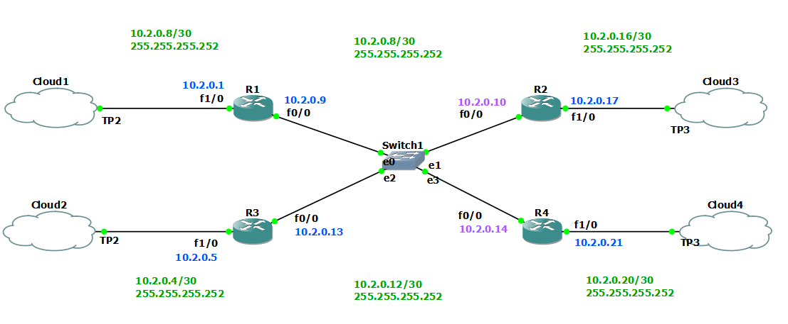

### Cloud1 topologia 1
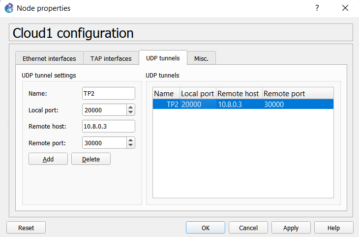
### Cloud2 topologia 1
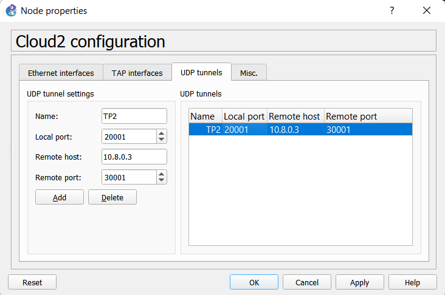
### Cloud3 topologia 1
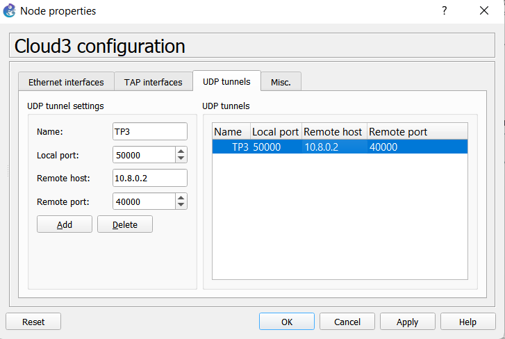
### Cloud4 topologia 1
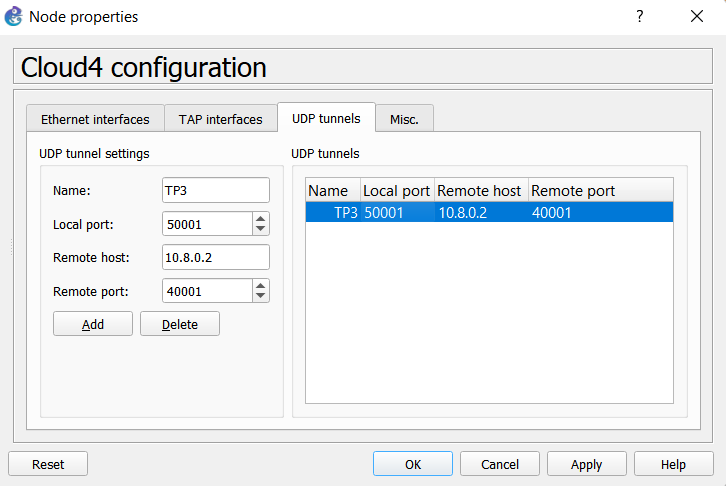

### -Routers
### R1 topologia 1
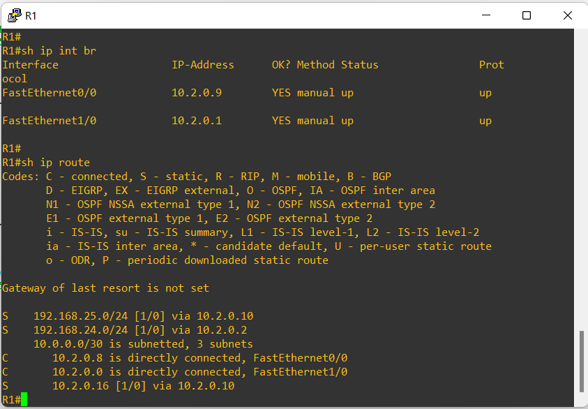
### R2 topologia 1
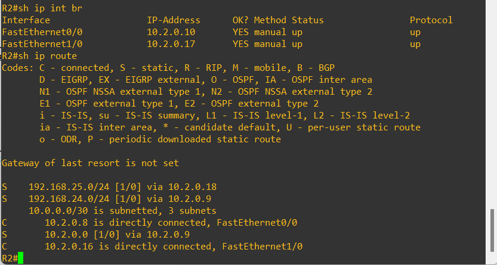
### R3 topologia 1
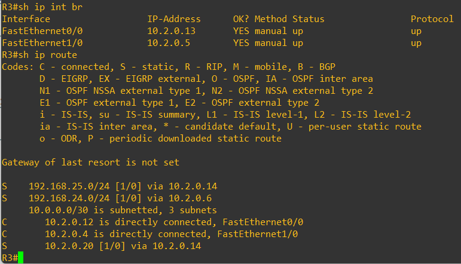
### R4 topologia 1
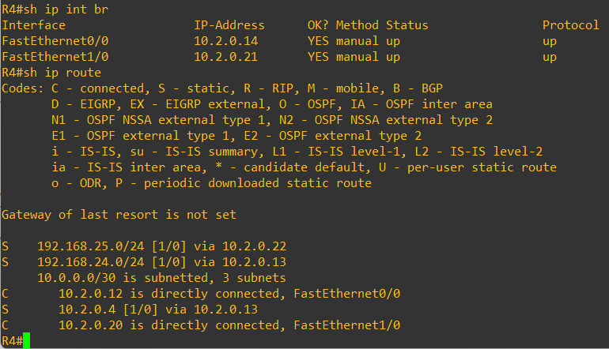

### Tabla resultante:
|Subred | IP de red |Mascara | Primer Host | Ultimo Host|Broadcast| No. de Hosts |
|-----|-----|-----|-----|-----|-----|-----|

### Topologia 2
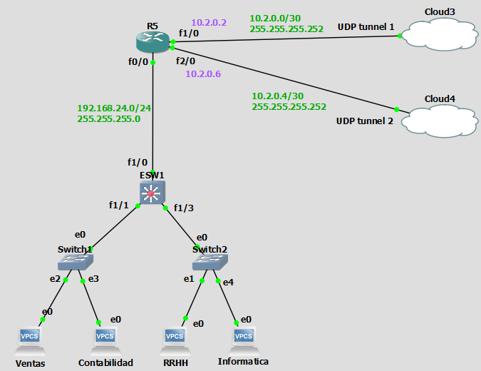

### Cloud3 topologia 2
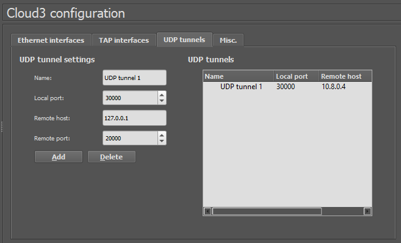
### Cloud4 topologia 2
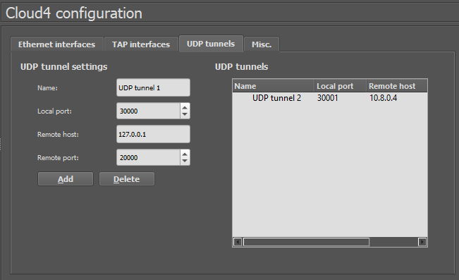

### VPCS topologia 2
### -Informatica
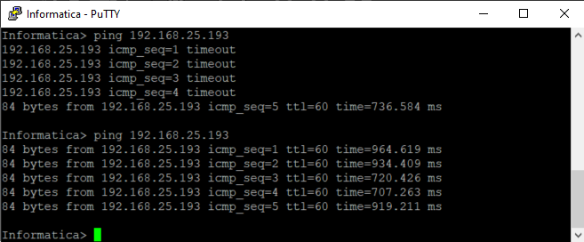
### -Contabilidad

### -RRHH
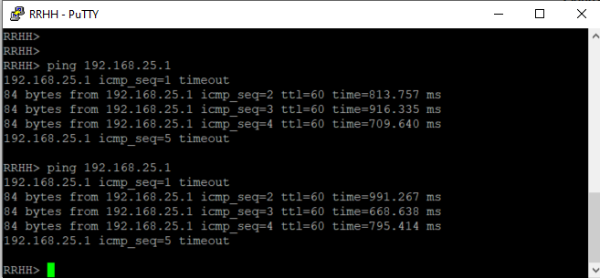
### -Ventas
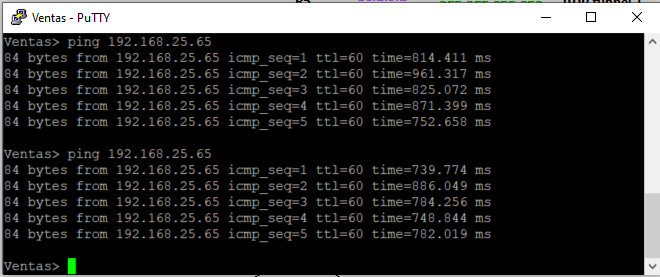

### Router topologia 2
### R5
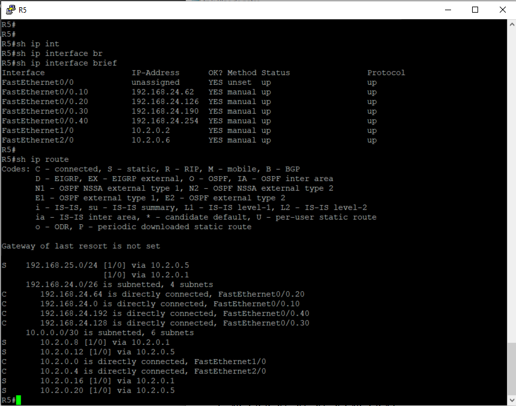

### ESW1
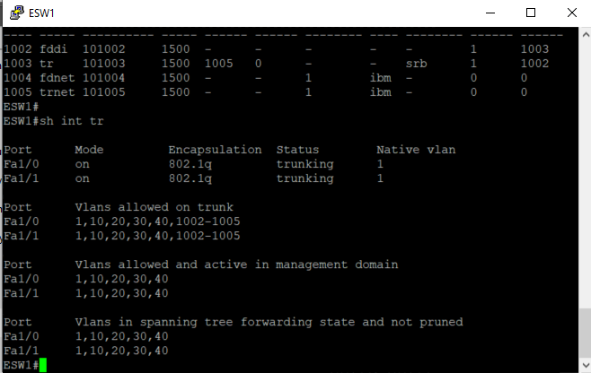
### VLANS topologia 2
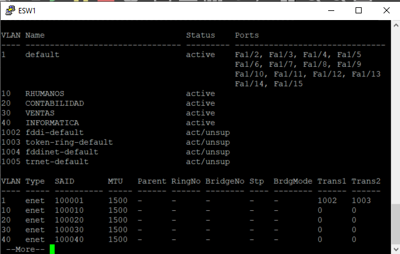
### Tabla resultante:
|Subred | IP de red |Mascara | Primer Host | Ultimo Host|Broadcast| No. de Hosts |
|-----|-----|-----|-----|-----|-----|-----|

### Topologia 3
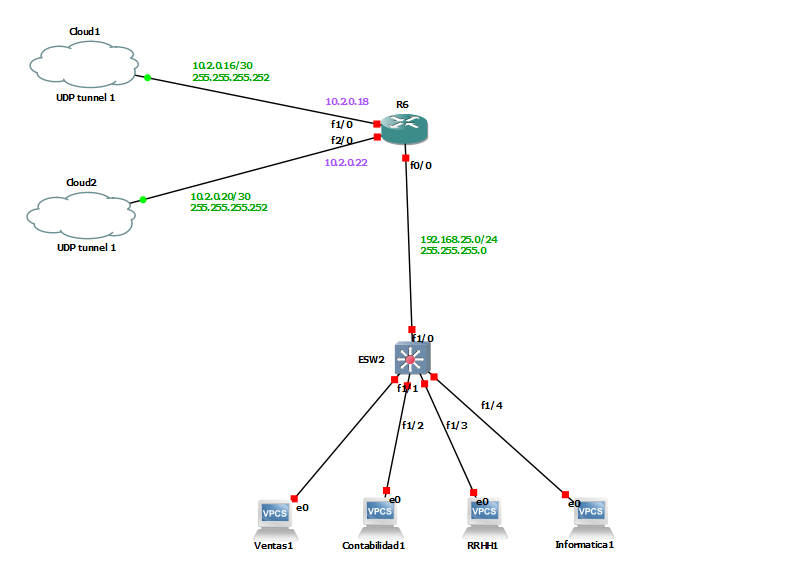
### Cloud1 topologia 3

### Cloud2 topologia 3
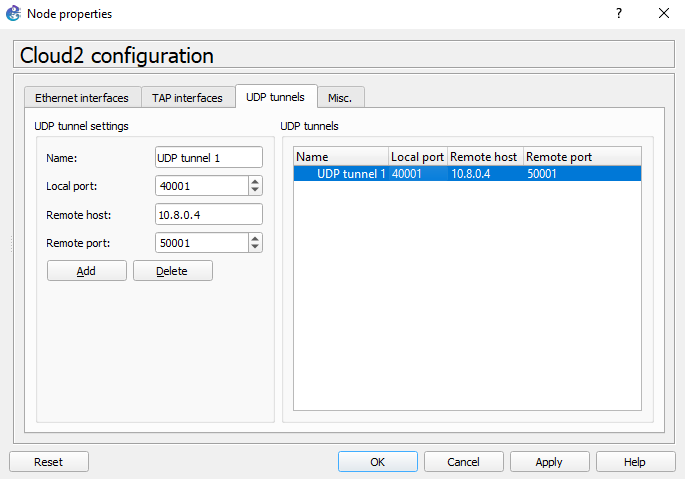
