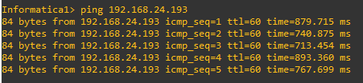

# Proyecto 2
---------------
## Integrantes
|Carne | Nombre | Perfil |
|-----|-----|-----|
|201901510| Pablo Daniel Rivas Marroquin| https://github.com/PabloRivas201901510 |
|201903850 |Adrian Samuel Molina Cabrera| https://github.com/AdrianMolina2000 |
|201807160 | Saul Absalon Barillas Argueta| https://github.com/SaulB10 |
|201902934 |German Jose Paz Cordon| https://github.com/GermanJosePazCordon |

## Manual Tecnico
Este proyecto se realizo en gns3, el objetivo de este es la creacion de redes utilizando dispositivos intermedios.
Haciendo subnetting ya sea FLSM o VLSM.

### Topologia 1

### Cloud1 topologia 1

### Cloud2 topologia 1

### Cloud3 topologia 1

### Cloud4 topologia 1

### -Routers
### R1 topologia 1

### R2 topologia 1

### R3 topologia 1

### R4 topologia 1

### Tabla resultante:
| Network | Mask | P.Asignable | U.Asignable | Broadcast | Host Totales | Cantidad de host |
|-----|-----|-----|-----|-----|-----|-----|
| 10.2.0.0/30 | 255.255.255.252 |10.2.0.1 | 10.2.0.2 | 10.2.0.3 | 2 | 2 | 
| 10.2.0.4/30 | 255.255.255.252 |10.2.0.5 | 10.2.0.6 | 10.2.0.7 | 2 | 2 |
| 10.2.0.8/30 | 255.255.255.252 |10.2.0.9 | 10.2.0.10 | 10.2.0.11 | 2 | 2 |
| 10.2.0.12/30 | 255.255.255.252 |10.2.0.13 | 10.2.0.14 | 10.2.0.15 | 2 | 2 |
| 10.2.0.16/30 | 255.255.255.252 |10.2.0.17 | 10.2.0.18 | 10.2.0.19 | 2 | 2 |
| 10.2.0.20/30 | 255.255.255.252 |10.2.0.21 | 10.2.0.22 | 10.2.0.23 | 2 | 2 |

### Topologia 2

### Cloud3 topologia 2

### Cloud4 topologia 2

### VPCS topologia 2
### -Informatica

### -Contabilidad

### -RRHH

### -Ventas

### Router topologia 2
### R5

### ESW1

### VLANS topologia 2

### Tabla resultante:
| Vlan | Salto | Network | Mask | P.Asignable | U.Asignable | Broadcast | Host Totales | Cantidad de host |
|-----|-----|-----|-----|-----|-----|-----|-----|-----|
| 10 | 62 | 192.168.24.0/26 | 255.255.255.192 | 192.168.24.1 | 192.168.24.62 | 192.168.24.63 | 62 | 1 | 
| 20 | 62 | 192.168.24.64/26 | 255.255.255.192 | 192.168.24.65 | 192.168.24.126 | 192.168.24.127 | 62 | 1 |
| 30 | 62 | 192.168.24.128/26 | 255.255.255.192 | 192.168.24.129 | 192.168.24.190 | 192.168.24.191 | 62 | 1 |
| 40 | 62 | 192.168.24.192/26 | 255.255.255.192 | 192.168.24.192 | 192.168.24.254 | 192.168.24.255 | 62 | 1 |

### Topologia 3

### Cloud1 topologia 3

### Cloud2 topologia 3

### VPCS
### -Informatica

### -Contabilidad

### -RRHH

### -Ventas

### Router

### ESW2

### VLANS
### Tabla resultante:

### Tabla resultante:
| Vlan | Salto | Network | Mask | P.Asignable | U.Asignable | Broadcast | Host Totales | Cantidad de host |
|-----|-----|-----|-----|-----|-----|-----|-----|-----|
| 10 | 62 | 192.168.25.0/26 | 255.255.255.192 | 192.168.25.1 | 192.168.25.62 | 192.168.25.63 | 62 | 1 | 
| 20 | 62 | 192.168.25.64/26 | 255.255.255.192 | 192.168.25.65 | 192.168.25.126 | 192.168.25.127 | 62 | 1 |
| 30 | 62 | 192.168.25.128/26 | 255.255.255.192 | 192.168.25.129 | 192.168.25.190 | 192.168.25.191 | 62 | 1 |
| 40 | 62 | 192.168.25.192/26 | 255.255.255.192 | 192.168.25.192 | 192.168.25.254 | 192.168.25.255 | 62 | 1 |
