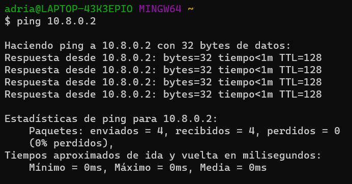

# Tarea 3

## Configuración de la red privada

## Conexión PING y de la configuración del protocolo IP (ipconfig/ifconfig)
### Pablo Daniel Rivas Marroquin, 201901510
#### PING

#### Protocolo IP

### Adrian Samuel Molina Cabrera, 201902850
#### PING

#### Protocolo IP

### German Jose Paz Cordon, 201902934
#### PING

#### Protocolo IP

### Saul Absalon Barillas Argueta, 201807160
#### PING
#### Protocolo IP

## Configuración del Software de VPN elegido

## Integrantes del grupo IAM

## Creación y configuración de la instancia en la plataforma cloud
Maquina Virtual

Información Basica

Configuración de la maquina

