# Tarea 3
### Integrantes
|Carne | Nombre |
|-----|-----|
|201901510| Pablo Daniel Rivas Marroquin|
|201902850 |Adrian Samuel Molina Cabrera| 
|201902934 |German Jose Paz Cordon| 
|201807160 | Saul Absalon Barillas Argueta| 

## Configuración de la red privada
#### Se desactivo el firewall para configurar la red
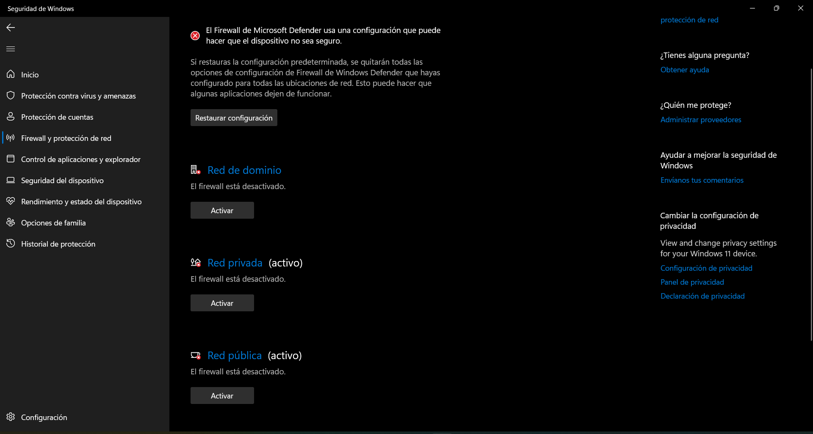
#### Comandos Utilizados
instalamos open vpn dentro de la maquina virtual: 
```
- sudo apt-get update
- sudo apt-get upgrade
Instalar wget y openvpn:
- wget version 
- sudo apt-get install wget 
- sudo wget https://cubaelectronica.com/OpenVPN/openvpn-install.sh
- sudo bash openvpn-install.sh
Agregar nuevo cliente: 
- sudo bash openvpn-install.sh
- sudo -i
- cp name.ovpn /home/
- exit 
```
## Conexión PING y de la configuración del protocolo IP (ipconfig/ifconfig)

### Adrian Samuel Molina Cabrera, 201902850
#### PING
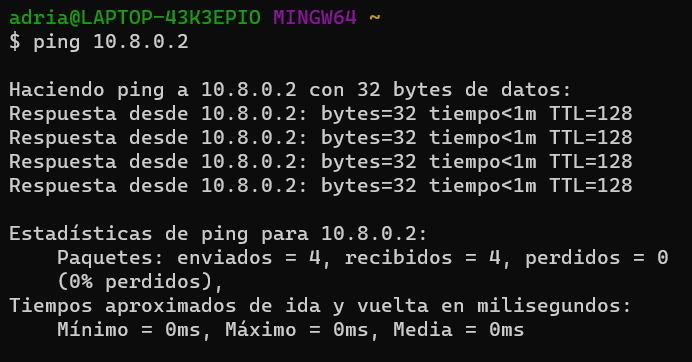
#### Protocolo IP
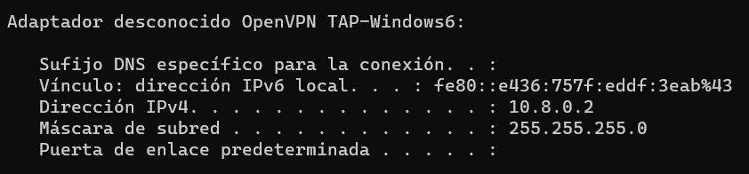
### Pablo Daniel Rivas Marroquin, 201901510
#### PING
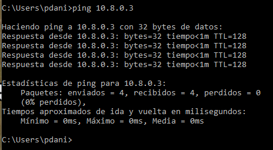
#### Protocolo IP
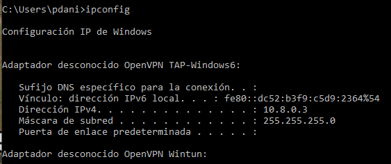
### German Jose Paz Cordon, 201902934
#### PING
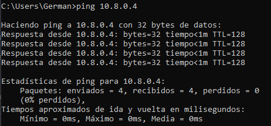
#### Protocolo IP
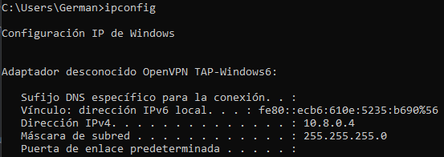
### Saul Absalon Barillas Argueta, 201807160
#### PING
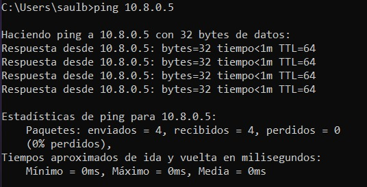
#### Protocolo IP
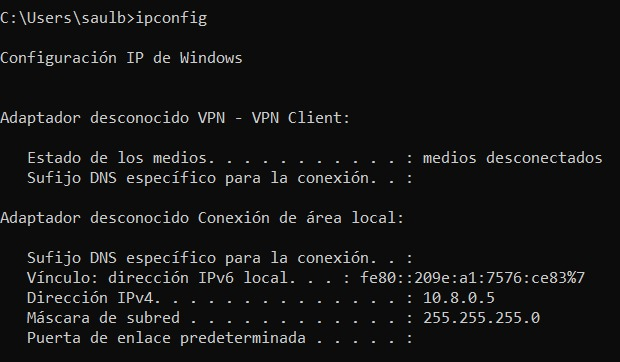

## Configuración del Software de VPN elegido
- El software para la conexion de de VPN se utilizao OpenVPN https://openvpn.net/
- Una vez instalado se importa el archivo .opvn
- Luego de que sea importado el archivo se conecta a la VPN

## Integrantes del grupo IAM
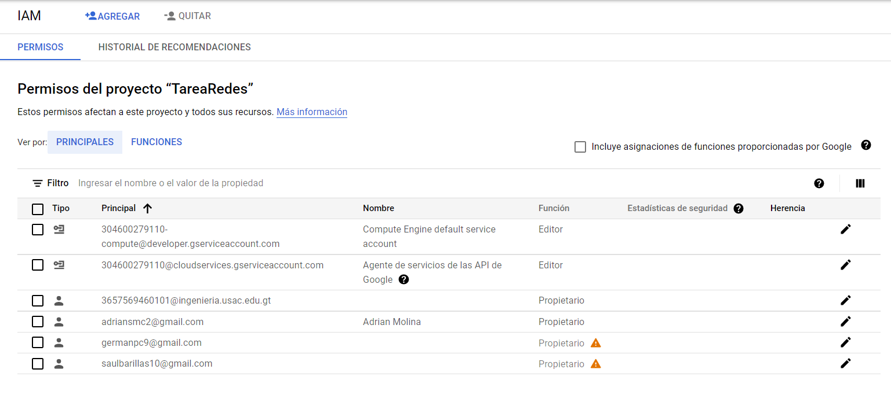
## Creación y configuración de la instancia en la plataforma cloud
Maquina Virtual
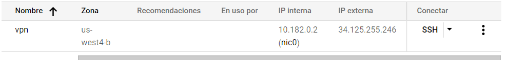
Información Basica

Configuración de la maquina
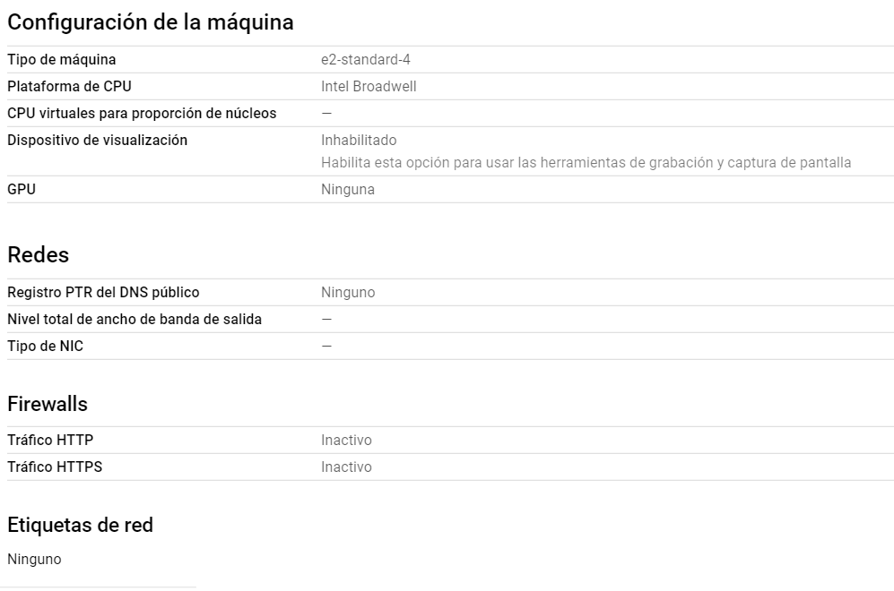

